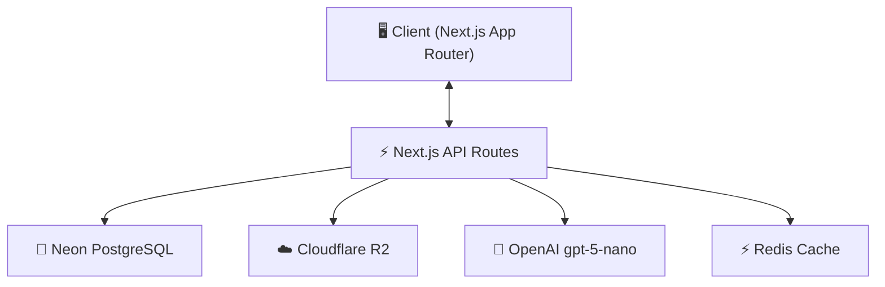
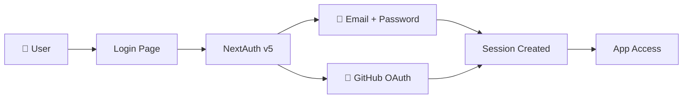
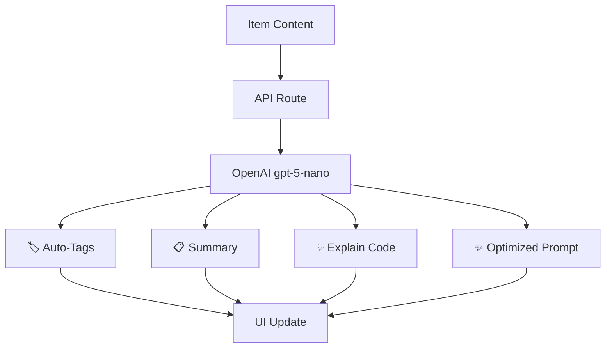

# 📦 CodeShelf — Project Overview

> **Store Smarter. Build Faster.**
>
> A centralized developer knowledge hub for code snippets, AI prompts, docs, commands & more.

---

## 📌 Problem

Developers keep their essentials scattered across dozens of tools:

- Code snippets in VS Code or Notion
- AI prompts buried in chat histories
- Context files hidden deep in project directories
- Useful links lost in browser bookmarks
- Documentation in random folders
- Terminal commands in `.txt` files or bash history
- Project templates in GitHub gists

This creates **context switching**, **lost knowledge**, and **inconsistent workflows**.

**CodeShelf provides ONE searchable, AI-enhanced hub for all dev knowledge & resources.**

---

## 🧑‍💻 Target Users

| Persona | Core Needs |
|---|---|
| **Everyday Developer** | Quick access to snippets, commands, links |
| **AI-First Developer** | Store & organize prompts, workflows, context files |
| **Content Creator / Educator** | Save course notes, reusable code blocks |
| **Full-Stack Builder** | Patterns, boilerplates, API references |

---

## ✨ Core Features

### A) Items & System Item Types

Every piece of knowledge saved in CodeShelf is an **Item**. Items belong to one of the following built-in types:

| Type | Icon | Description |
|---|---|---|
| Snippet | `</>` | Code blocks with syntax highlighting |
| Prompt | `🤖` | AI prompts and workflows |
| Note | `📝` | Markdown-formatted text |
| Command | `>_` | Terminal / CLI commands |
| File | `📄` | Uploaded documents and templates |
| Image | `🖼️` | Screenshots, diagrams, visual references |
| URL | `🔗` | Bookmarked links with metadata |

Pro users can define **custom item types** with their own icons and colors.

### B) Collections

Organize items into collections — mixed item types allowed.

Examples: *React Patterns*, *Context Files*, *Python Snippets*, *Interview Prep*

### C) Search

Full-text search across content, tags, titles, and types.

### D) Authentication

- Email + Password
- GitHub OAuth

### E) Additional Features

- ⭐ Favorites & pinned items
- 🕐 Recently used
- 📥 Import from files
- ✏️ Markdown editor for text items
- 📎 File uploads (images, docs, templates)
- 📤 Export (JSON / ZIP)
- 🌙 Dark mode (default)

### F) AI Superpowers

| Feature | Description |
|---|---|
| Auto-tagging | Suggest relevant tags based on content |
| AI Summaries | Generate concise summaries of long items |
| Explain Code | Natural language explanation of code snippets |
| Prompt Optimization | Improve prompt quality and structure |

> AI powered by **OpenAI `gpt-5-nano`**

---

## 🧱 Tech Stack

| Category | Choice | Notes |
|---|---|---|
| Framework | [Next.js](https://nextjs.org/) (React 19) | App Router |
| Language | TypeScript | Strict mode |
| Database | [Neon](https://neon.tech/) PostgreSQL + [Prisma](https://www.prisma.io/) ORM | Serverless Postgres |
| Caching | Redis | Optional — for search & session caching |
| File Storage | [Cloudflare R2](https://developers.cloudflare.com/r2/) | S3-compatible object storage |
| CSS / UI | [Tailwind CSS v4](https://tailwindcss.com/) + [shadcn/ui](https://ui.shadcn.com/) | Utility-first + accessible components |
| Auth | [NextAuth v5](https://authjs.dev/) | Email + GitHub providers |
| AI | [OpenAI](https://platform.openai.com/) `gpt-5-nano` | Lightweight model for in-app features |
| Deployment | [Vercel](https://vercel.com/) | Edge-optimized hosting |
| Monitoring | [Sentry](https://sentry.io/) | Added post-MVP |

---

## 🗄️ Data Model

> Prisma schema — this is a starting point and **will evolve**.

```prisma
model User {
  id                   String       @id @default(cuid())
  email                String       @unique
  password             String?
  isPro                Boolean      @default(false)
  stripeCustomerId     String?
  stripeSubscriptionId String?

  items                Item[]
  itemTypes            ItemType[]
  collections          Collection[]
  tags                 Tag[]

  createdAt            DateTime     @default(now())
  updatedAt            DateTime     @updatedAt
}

model Item {
  id           String      @id @default(cuid())
  title        String
  contentType  String      // "text" | "file"
  content      String?     // used for text-based types
  fileUrl      String?
  fileName     String?
  fileSize     Int?
  url          String?
  description  String?
  isFavorite   Boolean     @default(false)
  isPinned     Boolean     @default(false)
  language     String?     // programming language for syntax highlighting

  userId       String
  user         User        @relation(fields: [userId], references: [id])

  typeId       String
  type         ItemType    @relation(fields: [typeId], references: [id])

  collectionId String?
  collection   Collection? @relation(fields: [collectionId], references: [id])

  tags         ItemTag[]

  createdAt    DateTime    @default(now())
  updatedAt    DateTime    @updatedAt
}

model ItemType {
  id       String   @id @default(cuid())
  name     String
  icon     String?
  color    String?
  isSystem Boolean  @default(false) // true for built-in types

  userId   String?
  user     User?    @relation(fields: [userId], references: [id])

  items    Item[]
}

model Collection {
  id          String   @id @default(cuid())
  name        String
  description String?
  isFavorite  Boolean  @default(false)

  userId      String
  user        User     @relation(fields: [userId], references: [id])

  items       Item[]

  createdAt   DateTime @default(now())
  updatedAt   DateTime @updatedAt
}

model Tag {
  id     String    @id @default(cuid())
  name   String
  userId String
  user   User      @relation(fields: [userId], references: [id])

  items  ItemTag[]
}

model ItemTag {
  itemId String
  tagId  String

  item   Item @relation(fields: [itemId], references: [id])
  tag    Tag  @relation(fields: [tagId], references: [id])

  @@id([itemId, tagId])
}
```

---

## 🔌 Architecture



## 🔐 Auth Flow



## 🧠 AI Feature Flow



---

## 💰 Monetization

| | Free | Pro |
|---|---|---|
| **Price** | $0 | $8/mo or $72/yr |
| **Items** | 50 | Unlimited |
| **Collections** | 3 | Unlimited |
| **Search** | ✅ Basic | ✅ Full-text |
| **Image Uploads** | ✅ | ✅ |
| **File Uploads** | ❌ | ✅ |
| **Custom Types** | ❌ | ✅ |
| **AI Features** | ❌ | ✅ |
| **Export** | ❌ | ✅ (JSON / ZIP) |

> Payment via **Stripe** — subscriptions + webhooks for plan syncing.

---

## 🎨 UI / UX

**Design philosophy:** Dark mode first. Minimal, developer-friendly. Syntax highlighting for code.

**Inspired by:** Notion, Linear, Raycast

### Layout

- **Collapsible sidebar** — filters, collections, item types
- **Main workspace** — grid or list view with item cards
- **Full-screen editor** — focused item editing with markdown support

### Responsive

- Mobile drawer for sidebar navigation
- Touch-optimized icons and buttons

---

## 🧭 Roadmap

### Phase 1 — MVP

- [ ] Items CRUD (all system types)
- [ ] Collections
- [ ] Full-text search
- [ ] Basic tagging
- [ ] Free tier limits enforcement
- [ ] Auth (email + GitHub)
- [ ] Dark mode UI

### Phase 2 — Pro

- [ ] AI features (auto-tag, summarize, explain, optimize)
- [ ] Custom item types
- [ ] File uploads (Cloudflare R2)
- [ ] Export (JSON / ZIP)
- [ ] Stripe billing & upgrade flow

### Phase 3 — Future

- [ ] Shared collections
- [ ] Team / Org plans
- [ ] VS Code extension
- [ ] Browser extension
- [ ] Public API + CLI tool
- [ ] Sentry monitoring

---

## 🗂️ Development Workflow

- **One branch per lesson** — students can follow along and compare
- Use **Cursor / Claude Code / ChatGPT** for AI-assisted development
- **Sentry** for runtime monitoring & error tracking (post-MVP)
- **GitHub Actions** for CI (optional)

```bash
# Branch naming convention
git switch -c lesson-01-setup
git switch -c lesson-02-auth
git switch -c lesson-03-items-crud
```

---

## 📌 Status

🟡 **In planning** — ready for environment setup & UI scaffolding.

---

*CodeShelf — Store Smarter. Build Faster.* 🚀
